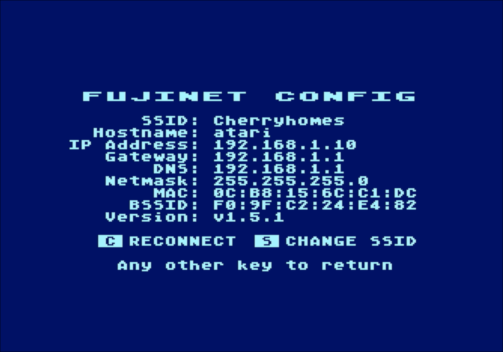
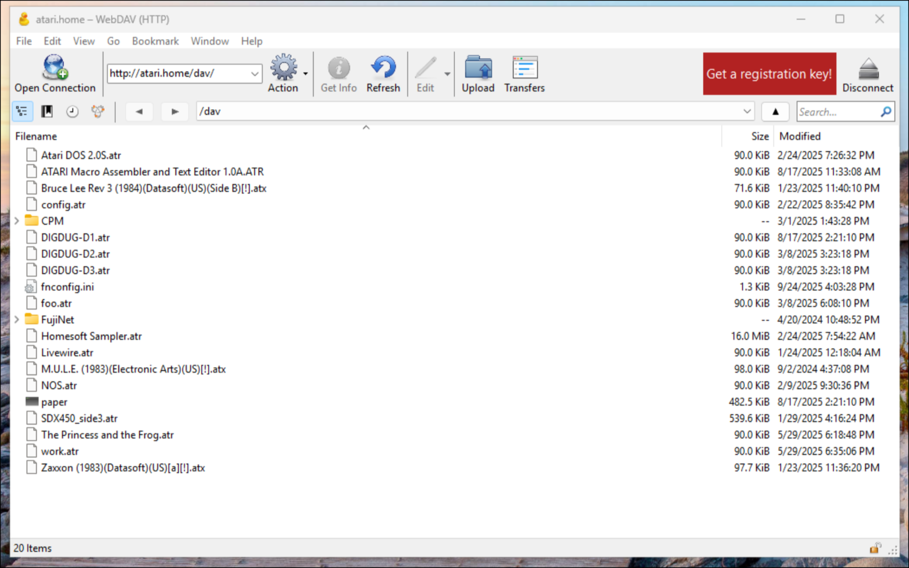
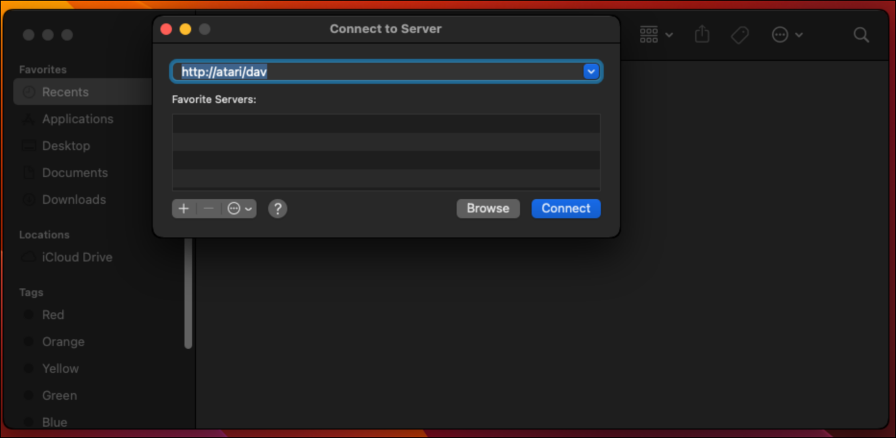
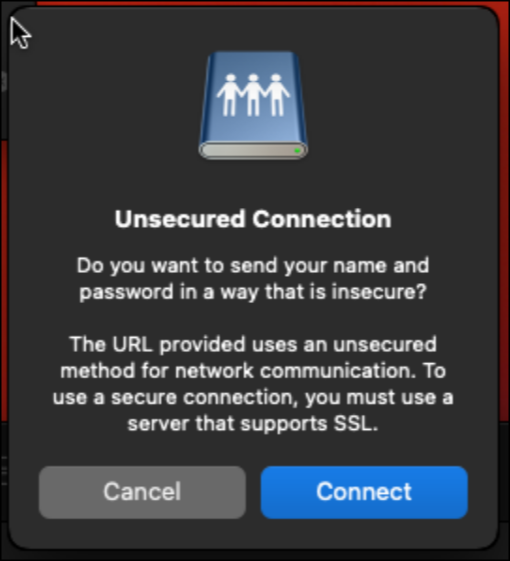
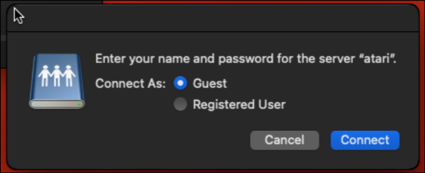
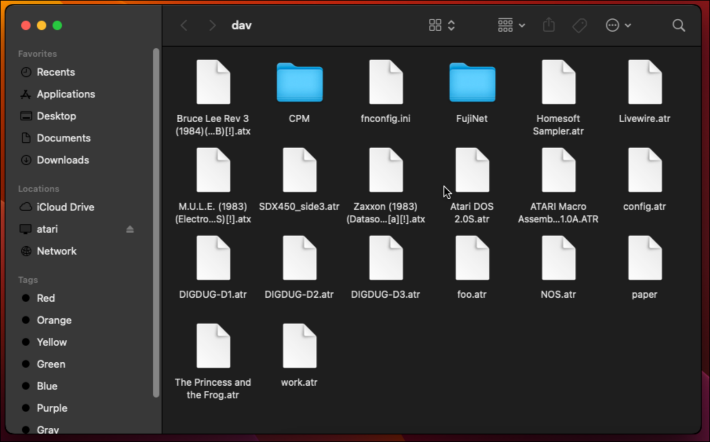
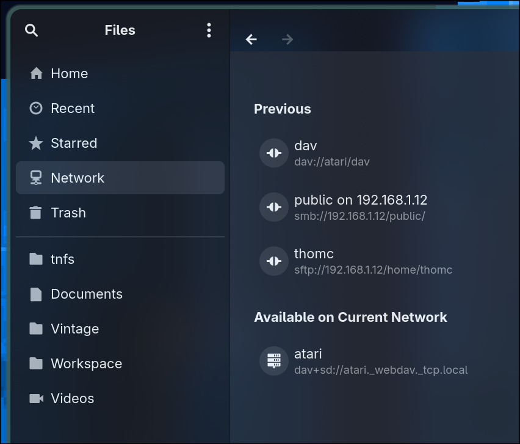
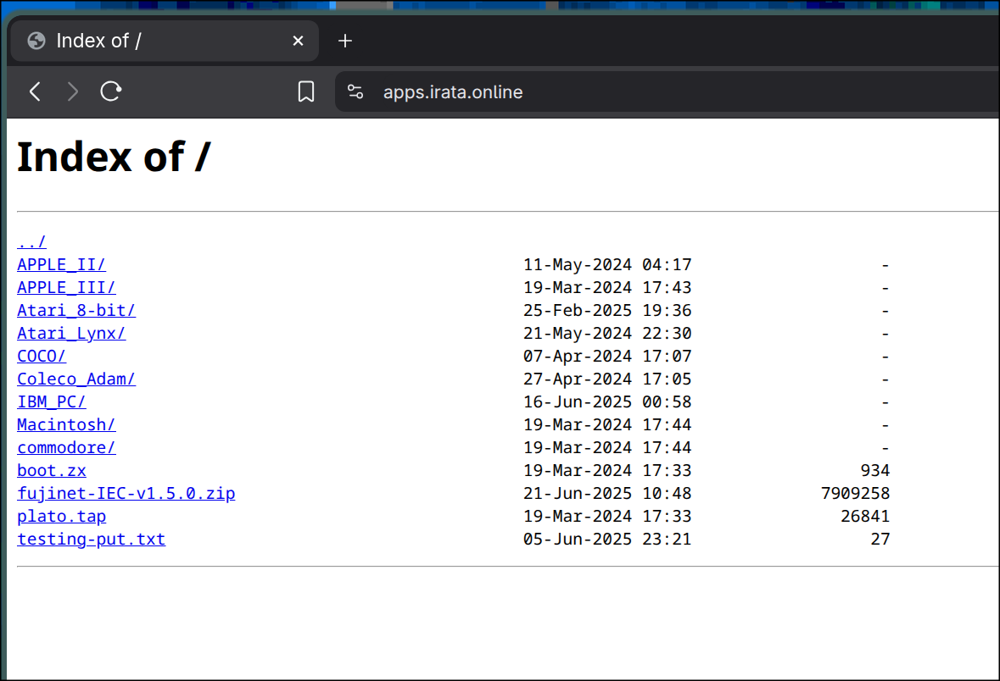
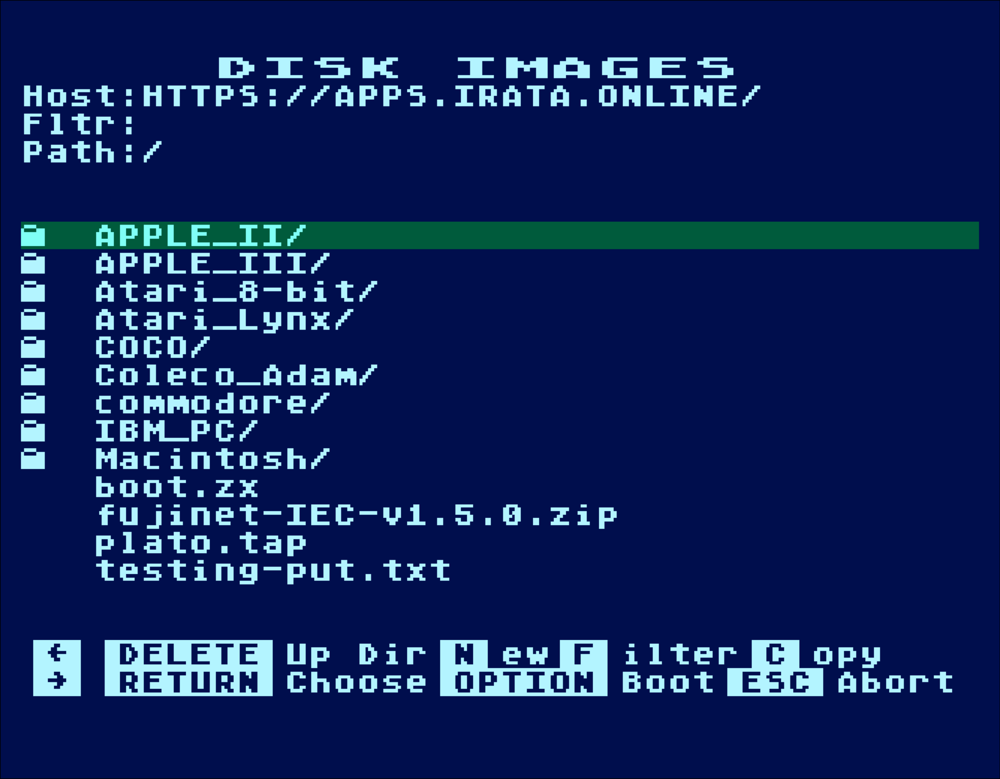

# Moving Files with FujiNet

One question new FujiNet users are often faced with is, "How do I transfer files to and from my FujiNet and my other computers?" There are multiple answers to fit a wide variety of scenarios, and this article will attempt to address each of them. You can not only transfer files to and from the FujiNet's SD card storage using the built in WebDAV server, but the FujiNet itself can connect to network servers, such as those running on network attached storage (NAS), or even publicly available servers.

In each of these approaches, the files live in their respective places, and the Fujinet will stream data as needed, one sector or block at a time. The only exception to this rule are file formats which much preserve copy protection semantics such as ATX, where the file is temporarily read into FujiNet memory for the duration of the mount.

Before I dive into each approach, it is important to know not only the host name or address of the server you wish to connect to, but to also know the host name or address of the FujiNet you are using. The former will be placed into one of the 8 available host slots so that you can connect to the server, and the latter is needed so that you can connect to the WebDAV server running on the FujiNet itself.

## Method 1: SD Card

The FujiNet will accept any SD, SDHC, or SDXC card formatted as FAT32, with a maximum capacity of 64 gigabytes (64GB.) You may not use ExFAT or any other filesystem format inside the FujiNet. Keep this in mind if you need to re-format the card.

MacOS can format the SD card using diskutil or the Disk Utility.

Windows can format the card using Diskpart, if the card is larger than 32GB.

Under Linux, you can format the card using mkdosfs:

```sh
mkdosfs -F 32 /dev/sda1  # assuming card is /dev/sda1
```

Once the card is formatted, you may arrange the files any way you wish, and physically move the card between your PC and the FujiNet to transfer files, which can then be accessed via the "SD" host slot from inside Config.

While this may seem straightforward, there is a way to eliminate the need to physically transfer the card between machines, and access the SD card as a drive across the network...

...but first we need to find the hostname of your Fujinet.

## Finding your FujiNet Hostname

After booting your FujiNet into CONFIG, press the 'C' for the Configuration screen. You'll find a list of pertinent network information including your hostname. Go ahead and grab the IP address, just in case your router does not resolve the host name.

**Note:** The default hostname, unless changed, is 'fujinet' If you wish to change it, go to the Web UI, change it, and restart your FujiNet.



Once you have your network information, try to see if you can ping your FujiNet. For example, if your hostname is "atari" open a terminal or command prompt, and issue the following command:

```sh
ping atari

PING atari.home (192.168.1.10) 56(84) bytes of data.
64 bytes from atari.home (192.168.1.10): icmp_seq=1 ttl=64 time=54.8 ms
64 bytes from atari.home (192.168.1.10): icmp_seq=2 ttl=64 time=28.1 ms
64 bytes from atari.home (192.168.1.10): icmp_seq=3 ttl=64 time=3.90 ms
64 bytes from atari.home (192.168.1.10): icmp_seq=4 ttl=64 time=3.97 ms
^C
--- atari.home ping statistics ---
4 packets transmitted, 4 received, 0% packet loss, time 3005ms
rtt min/avg/max/mdev = 3.902/22.688/54.753/20.981 ms
```

While Windows by default performs five ping attempts, Linux and MacOS will perform the ping indefinitely until you press CONTROL-C to interrupt it.

Note: In this case, my router gives the full name of my Atari fujinet as "atari.home." Use this full name when referring to the FujiNet for best results.

If you get something similar to "unknown host" this may mean that your router does not perform any convenient hostname resolution for your local networked computers, and you will need to use the IP address instead, such as:

```sh
ping 192.168.1.10
PING 192.168.1.10 (192.168.1.10) 56(84) bytes of data.
64 bytes from 192.168.1.10: icmp_seq=1 ttl=64 time=4.07 ms
64 bytes from 192.168.1.10: icmp_seq=2 ttl=64 time=7.34 ms
64 bytes from 192.168.1.10: icmp_seq=3 ttl=64 time=5.48 ms
64 bytes from 192.168.1.10: icmp_seq=4 ttl=64 time=5.65 ms
^C
--- 192.168.1.10 ping statistics ---
4 packets transmitted, 4 received, 0% packet loss, time 3004ms
rtt min/avg/max/mdev = 4.067/5.633/7.343/1.162 ms
```

## Method 2: Access SD card via WebDAV Server

The SD card can be accessed across the network via a built in WebDAV server that runs on the FujiNet itself, and the PC sees a "Web Folder" with which it can interact.

**Note**: The FujiNet must be powered on, for this feature to work. The best way to ensure this is to connect the FujiNet's USB port to a USB power brick.

### The WebDAV URL:
Assuming your hostname is "atari.home" as above, the URL is:
http://atari.home/dav/

Each operating system has a different way to handle WebDAV folders, and we will address each one:

### WebDAV SD folder from Windows

**An unfortunate note:** This was once a very simple proposition, as Microsoft was co-creator of WebDAV, and Windows Explorer supports WebDAV. However, due to ever changing security requirements imposed by Microsoft regarding WebDAV folders in recent months, the Explorer can't currently be used to access the WebDAV folder on the FujiNet (because un-authenticated HTTP connections are no longer allowed)  and a third-party client must be used, such as CyberDuck. We will attempt to address the newly imposed security restrictions in an upcoming firmware release (by adding both HTTPS webdav and authentication), so that Explorer can once again be used directly, until then...

A copy of CyberDuck can be downloaded from: https://cyberduck.io/download/

Once downloaded, select the Quick Connect and assuming your hostname is "atari.home," type in the WebDAV URL:
http://atari.home/dav/

You should then see the contents of your SD card:


### WebDAV folder from MacOS

The MacOS finder can handle the WebDAV folder directly. The FujiNet broadcasts a DNS-SD record for the WebDAV share and the Finder will automatically display it in your Network view, if discovered.

If for some reason the network share isn't discovered, you can still use Connect to Server to attach to the WebDAV folder by specifying the WebDAV URL (assuming your hostname is atari.home):
http://atari.home/dav/



Finder will casually mention that it is an unsecured connection, and ask if you're sure you wish to connect. Press the "Connect" button.



Finder will then ask for the username and password credentials by default. Select the button for Guest, instead, and press "Connect" again. You will then be presented with the contents of the FujiNet SD card in the Finder.





### WebDAV folder from Linux

Similar to MacOS, Linux also supports discovering WebDAV folders via DNS-SD, so file managers such as Nautilus and Dolphin can automatically detect and connect to network shares:



If for some reason, your file manager is unable to discover the network share, you can manually connect to the WebDAV share using the Connect bar at the bottom of the Network view in Nautilus, or by entering the address in the remote address bar in Dolphin, assuming your hostname is "atari.local"

- Nautilus: dav://atari.local/dav/
- Dolphin: webdav://atari.local/dav/

## Method 3: Set up a TNFS Server

TNFS is a network file sharing protocol developed originally for the SpectraNet, a network adapter for the ZX Spectrum, and was adopted by the FujiNet early in development due to its simplicity of implementation and deployment. The TNFS server "tnfsd" is a single binary that only has a single parameter, the directory to serve, and can be run in a console window, or as a background process.

While it may seem superfluous for a single FujiNet user to have a server, its usefulness can quickly become apparent if you wish to share the same files across more than one FujiNet, or if you wish to provide a repository of files publicly.

The majority of public servers for FujiNet are TNFS servers.

You can download the latest TNFSD from https://fujinet.online/download/

Once unpacked, it can quickly be tested by making a folder, and running tnfsd from a terminal or command prompt. For example, if you created a folder called **PublicFiles**, you could place tnfsd in the same folder beside PublicFiles and start it with the following command:

```sh
tnfsd PublicFiles
[2025-09-25T01:20:15Z] Starting tnfsd version 25.0111.1-dev on port 16384 using root directory "PublicFiles"
[2025-09-25T01:20:15Z] The server runs in read-write mode. TNFS clients can upload and modify files. Use -r to enable read-only mode.
```

While running in this mode, closing the window, or pressing CONTROL-C, will stop tnfsd and its ability to serve files, until it is restarted.

TNFSD can be loaded as a server process. There is plenty of documentation on how to start a program at startup on Windows, MacOS, and Linux. Under Linux, I created a systemd unit to start my tnfsd server.

There is also a Docker container available:

```sh
docker run -d --name tnfs --publish 16384:16384/tcp --publish 16384:16384/udp --volume $PWD/tnfs:/data zaqu/tnfsd:latest
```

Once started, you can edit one of your host slots in CONFIG, to connect to your TNFS server, e.g. if your PC is called TMA-3, then your host slot would be:
```
TMA-3
```

## Method 3: Connect to a Windows (SMB aka CIFS) fileshare

FujiNet can mount disk images stored on shared folders in a Windows network. Microsoft calls this protocol CIFS (formerly called SMB), and it is also supported by popular server and network attached storage (NAS) solutions.

**NOTE:** To make this as easy as possible to configure, the share in question must be public, and not have any authentication enabled. There are plenty of examples of how to set this up, on the Internet.

Once a share is set up, you can edit a host slot in CONFIG, and specify an SMB share with the following syntax:

```
SMB://server_name_or_address/share_name
```

## Method 4: Connect to a Web Server with a file index.

Some repositories of files are available on the web, and they have automatically generated file indexes, or are accessible via WebDAV. FujiNet can access these HTTP and HTTPS sites, and load the media from them just like any of the previously mentioned methods.

An example of this is: https://apps.irata.online/ which mirrors the TNFS site. If you access this from a PC browser, you'll see a file index.



If you type the following into a host slot in CONFIG:
```
HTTPS://APPS.IRATA.ONLINE/
```

and subsequently open it, you'll see the same list of files.



## The Importance of Permissions

Since resources exposed across a network could potentially be used by multiple people, there are always considerations built into the network protocols used so that appropriate permission can be determined and applied for each and every file accessed. Even for the simplest TNFS protocol, which does no user authentication, underlying file permissions are taken into account. This means that if you have a file marked as read-only by the user running TNFS, that file will not be writable by anyone connecting to the server. This is important for publicly available servers, as it will prevent users from accidentally corrupting files by inadvertently writing to them. So if you want to run a public server? Make sure all your files are read-only.

## Example Host Slots

- TNFS: apps.irata.online
- HTTP: HTTPS://apps.irata.online/
- SMB: SMB://myserver/public/

## Example WebDAV URLs:

Here is a quick list of example URLs to access your FujiNet's built-in WebDAV server, which shows your SD card. Each example assumes the hostname of your FujiNet is "atari.home"

- Windows (CyberDuck) http://atari.home/dav/
- MacOS (Finder) http://atari.home/dav/
- Linux (Nautilus) dav://atari.home/dav/
- Linux (Dolphin) webdav://atari.home/dav/

## Conclusion

Hopefully, the approaches I've outlined here in this article are comprehensive enough to accomodate the varied needs of FujiNet users and their respective networks. The firmware is flexible enough that we can add more network protocols if they are needed (Google-Drive, anyone?).

One aspect of FujiNet use that I did not cover is that the network device can also be used to access individual files present on many of these same network protocols, because it needs to be covered in a future article.

Is there an aspect of transferring files that I did not cover in this article? Let me know! I am @tschak909 on X, and can be reached via the FujiNet Users Group on Facebook, or even via the contact form on fujinet.online.
