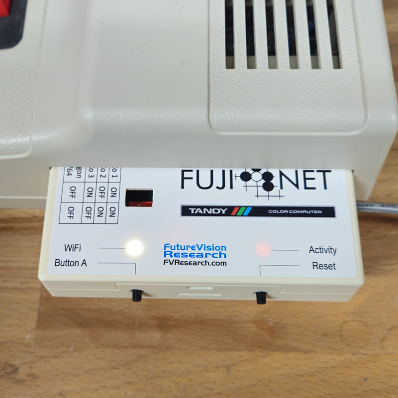
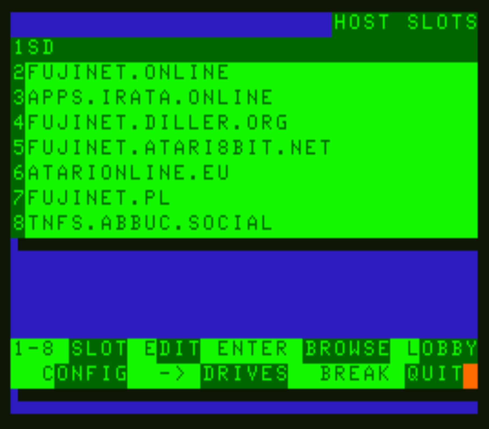
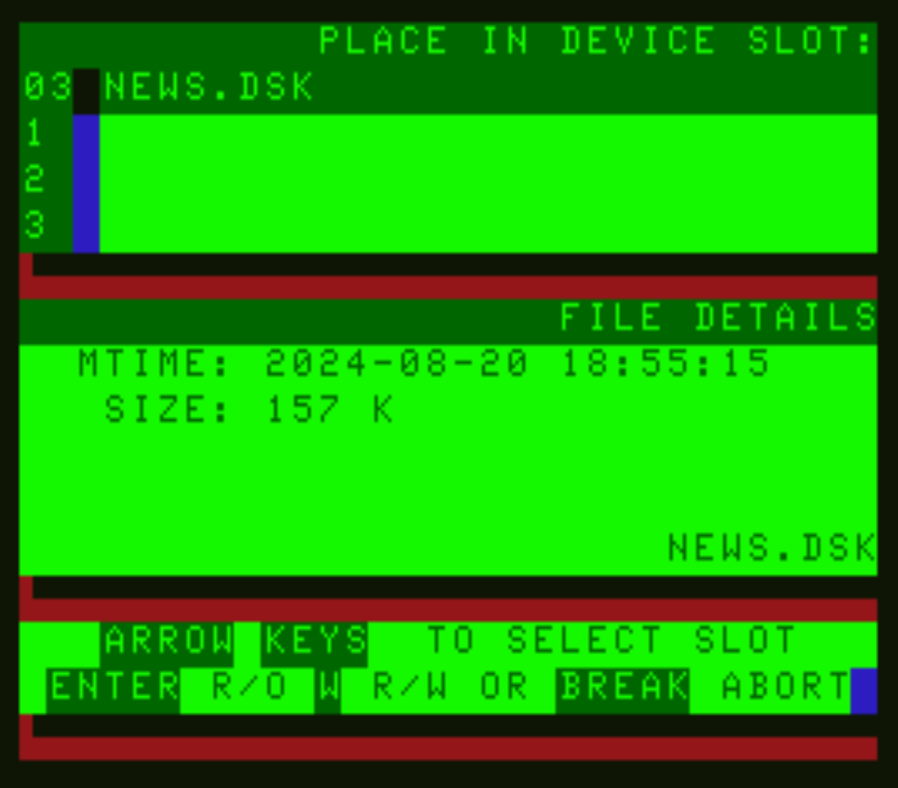
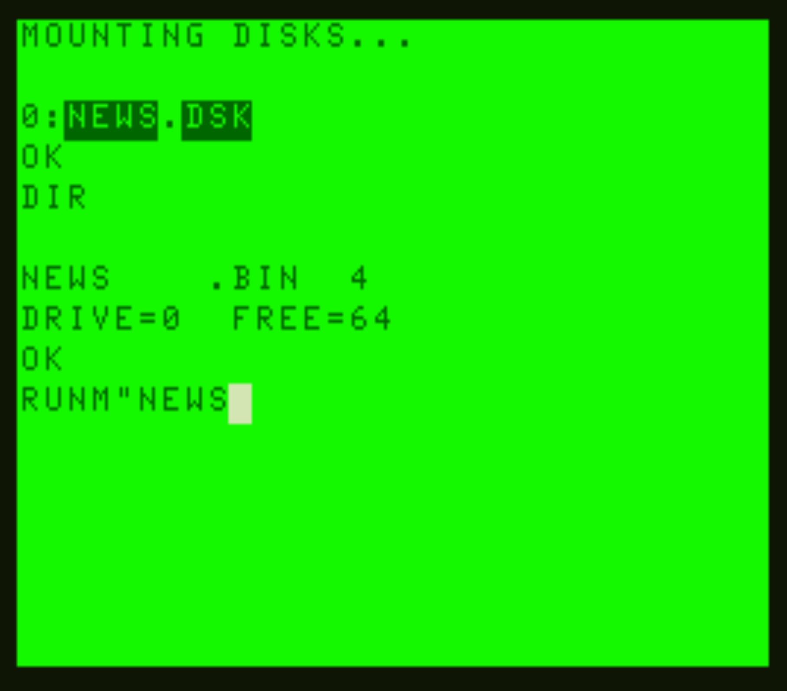
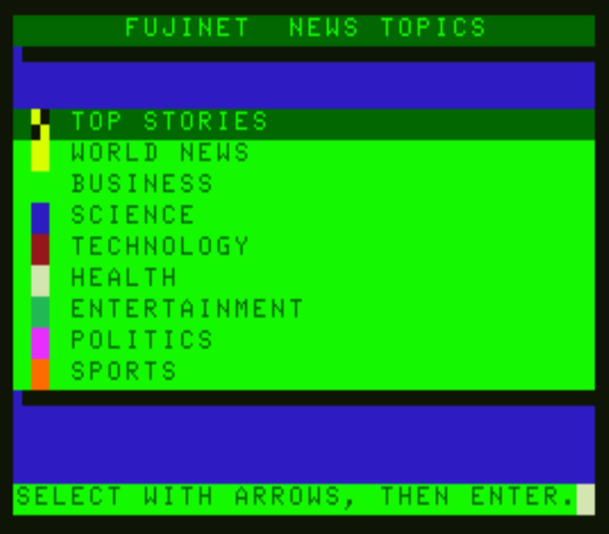

# FujiNet and the CoCo

FujiNet is a Wi-Fi network adapter available for a growing number of retrocomputing and retrogaming platforms. This includes the TRS-80 Color Computer, bringing to it all of the features, such as loading software from the Internet, or via local SD card storage, and a network adapter that can connect to and use a wide variety of network resources, in a convenient cartridge that can plug into the expansion port, or to a multi-pak, working with all three of the TRS-80 Color Computer models.

## Using FujiNet on the CoCo

For the CoCo, the FujiNet is implemented using the DriveWire protocol, which has been in use by the Color Computer community for more than two decades. FujiNet extends the protocol by adding two opcodes: OP_FUJI 0xE2 for FujiNet control and configuration commands, and OP_NET 0xE3 for network adapter commands. Meanwhile, the cartridge itself contains an EPROM containing the HDB-DOS ROM, which provides a version of Disk Extended Color BASIC (DECB) that is set up to use the DriveWire protocol that the CoCo FujiNet speaks. A 4 pin DIN connector attaches to the SERIAL PORT connector on the back of the CoCo, and is used for all communication between the FujiNet microcontroller (an ESP32), and the CoCo. 



Once the FujiNet is inserted, powering on the computer will also power on the FujiNet. This causes the FujiNet to mount its configuration program disk (CONFIG) which is contained within the flash memory of the ESP32 microcontroller, and provide it as drive 0. This is done before the system completes booting into HDB-DOS enhanced BASIC. This disk contains an AUTOEXEC.BAS, which will automatically load and run the CONFIG program, where you can do all of the needed initial start-up such as mounting disk images.

Host Slots represent the possible hosts from which you can mount disk images. These can be a server that you run on your local network, or a remote server on the Internet. There is also one special slot, SD, which corresponds to a card mounted in the SD slot.



Selecting a host slot, such as APPS.IRATA.ONLINE will connect to that host, and present a directory of disk images that you can navigate and mount. APPS.IRATA.ONLINE contains a folder called /COCO/FUJINET/ which contains a list of programs that you can use, such as:

* GAMES-DW.DSK - A large stack of disks pre-loaded with hundreds of TRS-80 Color Computer games.
* ISS.DSK - Displays the current position of the International Space Station (ISS) 
* MASTODON.DSK - Displays the most recent public post from the OLDBYTES.SPACE Mastodon server.
* NETCAT.DSK - An example dumb terminal program that supports any FujiNet protocol. 
* NEWS.DSK - Read the news, aggregated from many different news sources.

Once a disk image, such as NEWS.DSK is selected, the user is given an opportunity to select which of the four drive slots to place the disk image into. Just as with physical drives on CoCo, these slots are labeled 0 to 3, and act the same. The access mode, whether to mount read only, or read write, is also chosen here. Administrators on public servers such as APPS.IRATA.ONLINE typically do not do not grant read/write permission for disk images, so read only should be chosen in this case. 



The user is given an opportunity to mount another disk image in the same directory (such as when mounting multiple disks to multiple drives), or the user can simply press the BREAK key to return to the HOST SLOTS menu.

Pressing BREAK at the host slots menu will exit the CONFIG program, mount the configured disk images into their drive slots, and exit to BASIC. You can then use the disk image as if it were any physical disk, such as issuing a DIR command to get a disk directory, or the RUNM command to load a binary file:



With NEWS.DSK loaded, and finding the NEWS.BIN program, we can run it with RUNM, and the program will stream directly from the Internet onto your TRS-80 Color Computer:




Pressing the reset button on your FujiNet, will re-set the FujiNet, putting the CONFIG program back into drive 0, and you can then type DOS (or press the RESET button) to return to CONFIG.

## FujiNet Programming on the CoCo

Since the FujiNet implements and extends DriveWire, all that is needed are a pair of routines to communicate with DriveWire, and a reference for the commands that you can send with the OP_FUJI and OP_NET opcodes.

OP_FUJI opcodes are configuration and disk mounting commands that are used by programs such as CONFIG to mount disk images, and can be used outside of CONFIG to perform those functions in unique ways.

An example of asking the FujiNet to RESET using a FUJI opcode would be:

| byte | meaning            |
|------|--------------------|
| 0xE2 | The OP_FUJI opcode |
| 0xFF | The Reset command  |

You can see the different commands that can be performed using the OP_FUJI opcode, in the FujiNet WIKI: https://github.com/FujiNetWIFI/fujinet-firmware/wiki/SIO-Commands-for-Device-ID-%2470

OP_NET opcodes are used for the network adapter, and provide the mechanism to handle every aspect of talking to something over the network, from opening the connection, asking if any data is present to be read, reading the data, writing data back, as well as closing the connection and doing special commands that change the behavior of a connection such as asking to parse JSON data. The following table shows the format of a NET opcode:

| byte    | meaning                             |
|---------|-------------------------------------|
| 0xE3    | The OP_NET opcode                   |
| channel | A channel number, from 0 to 255     |
| command | The command byte (0x00-0xFF)        |
| aux1    | Parameter byte 1                    |
| aux2    | Parameter byte 2                    |
| payload | optional payload that may be needed |

You can see all of the different possible commands for the OP_NET opcode here in the FujiNet WIKI: https://github.com/FujiNetWIFI/fujinet-firmware/wiki/SIO-Commands-for-Device-IDs-%2471-to-%2478

### Sending/receiving DriveWire commands

Sending and receiving over DriveWire using the routines provided by the HDB-DOS can be performed using the following two pieces of assembler code, which has also been conveniently wrapped into a C function that can be used from the CMOC compiler:

```c
/**
 * @brief DriveWire Functions
 */

#include "dw.h"

/**
 * @brief Read string to s from DriveWire with expected length l
 * @param s pointer to string buffer
 * @param l expected length of string (0-65535 bytes)
 * @return 1 = read successful, 0 = not successful
 */
byte dwread(byte *s, int l)
{
    asm
    {
        pshs x,y
            ldx :s
            ldy :l
            jsr [0xD93F]
            puls y,x
            tfr cc,b
            lsrb
            lsrb
            andb #$01
            }
}

/**
 * @brief Write string at s to DriveWire with length l
 * @param s pointer to string buffer
 * @param l length of string (0-65535 bytes)
 * @return error code
 */
byte dwwrite(byte *s, int l)
{
    asm
    {
        pshs x,y
            ldx :s
            ldy :l
            jsr [0xD941]
            tfr cc,d
            puls y,x
            }
}
```

### Example Program to send an OP_FUJI opcode to reset the FujiNet

And writing a simple program in C (using the CMOC compiler) to reset the FujiNet would look like this:

```c
/**
 * @brief Program to reset the FujiNet
 */
 
 #include <cmoc.h>
 #include <coco.h>
 
int main(void)
{
	struct
	{
		byte opcode;
		byte cmd;
	} c;
	
	c.opcode = 0xE2; /* OP_FUJI */
	c.cmd    = 0xFF; /* RESET   */
	
	printf("Resetting the FujiNet.");
	
	/* Perform the command. */
	dwwrite((byte *)&c, sizeof(c));
	
	/* Return to BASIC. */
	
	return 0;
}
```

### Example Program to Get Latest Post from a Mastodon Server

Mastodon is a publicly federated micro-blogging service, similar to X (the bird-site formerly known as Twitter) or BlueSky. Since it has a publicly accessible API and it processes data in JSON, the FujiNet can interact with it. This simple program, will display the most recent public post on a Mastodon server (it is currently hard-coded to fetch from OLDBYTES.SPACE, but it can be changed to other servers, or made into a much better program), it is written in C and can be compiled with the CMOC compiler, available from: http://sarrazip.com/dev/cmoc.html

The program itself is split into a few pieces:

* dw.c contains the routines pasted above to provide the DriveWire communication to the FujiNet.
* net.c provides a set of convenience routines for opening, closing, reading, and asking the FujiNet to parse and query through the JSON that the Mastodon server sends back.
* main.c The main part of the program that displays the post, waits a bit, and repeats the process.

```c
#include <cmoc.h>
#include <coco.h>
#include "dw.h"
#include "net.h"

#define OP_NET 0xE3

#define CMD_READY 0x00
#define CMD_RESPONSE 0x01
#define CMD_ERROR 0x02
#define CMD_OPEN 'O'
#define CMD_CLOSE 'C'
#define CMD_PARSE_JSON 'P'
#define CMD_QUERY_JSON 'Q'
#define CMD_READ 'R'
#define CMD_STATUS 'S'
#define CMD_SET_CHANNEL_MODE 0xFC

/**
 * @brief wait for network device ready
 * @param devid Device ID (0=255)
 */
void net_ready(byte devid)
{
    struct _readycmd
    {
        byte opcode;
        byte id;
        byte command;
        byte aux1;
        byte aux2;
    } rc;

    byte z=0, r=0;
    
    rc.opcode = OP_NET;
    rc.id = devid;
    rc.command = CMD_READY;
    rc.aux1 = rc.aux2 = 0;
    
    while (!z)
    {
        dwwrite((byte *)&rc,sizeof(rc));
        z = dwread((byte *)&r,sizeof(r));
    }
}
/**
 * @brief get last error code
 * @param devid Device ID (0-255)
 * @return error code byte
 */
byte net_error(byte devid)
{
    struct _errcmd
    {
        byte opcode;
        byte id;
        byte command;
        byte aux1;
        byte aux2;
    } ec;

    byte z=0;
    byte err=0;
    
    ec.opcode = OP_NET;
    ec.id = devid;
    ec.command = CMD_ERROR;
    ec.aux1 = ec.aux2 = 0;

    net_ready(devid);
    
    dwwrite((byte *)&ec, sizeof(ec));
    z = dwread(&err,1);
   
    return z ? z : err;
}

/**
 * @brief Get response data from last command
 * @param devid The device ID (0-255) 
 * @param buf Target buffer 
 * @param len Length 
 */
byte net_get_response(byte devid, byte *buf, int len)
{
    struct _getresponsecmd
    {
        byte opcode;
        byte id;
        byte command;
        int len;
    } grc;

    byte z=0;
    
    grc.opcode = OP_NET;
    grc.id = devid;
    grc.command = CMD_RESPONSE;
    grc.len = len;

    net_ready(devid);
    dwwrite((byte *)&grc, sizeof(grc));
    dwread((byte *)buf, len);
    
    return z;
}

/**
 * @brief Open network connection
 * @param devid Device ID (0-255)
 * @param mode Open Mode (4=READ, 6=DIR, 8=WRITE, 9=APPEND, 12=READ/WRITE, 13=POST) 
 * @param trans Translation mode (0=none) 
 * @param url 256 byte max, N: URL
 * @return result code
 */
byte net_open(byte devid, byte mode, byte trans, const char *url)
{
    struct _opencmd
    {
        byte opcode;
        byte id;
        byte command;
        byte mode;
        byte trans;
        char url[256];
    } oc;

    oc.opcode = OP_NET;
    oc.id = devid;
    oc.command = CMD_OPEN;
    oc.mode = mode;
    oc.trans = trans;

    memset(oc.url,0,256);
    strcpy(oc.url,url);

    // wait for ready
    net_ready(devid);
    
    // Send open command
    dwwrite((byte *)&oc, sizeof(oc));

    // check status of open
    net_ready(devid);
    
    // Return result of open
    return net_error(devid);
}

/**
 * @brief Close network connection
 * @param devid Device ID (0-255)
 */
void net_close(byte devid)
{
    struct _closecmd
    {
        byte opcode;
        byte id;
        byte command;
        byte aux1;
        byte aux2;
    } cc;

    cc.opcode = OP_NET;
    cc.id = devid;
    cc.command = CMD_CLOSE;
    cc.aux1 = cc.aux2 = 0;

    // Wait for ready
    net_ready(devid);

    // Send command
    dwwrite((byte *)&cc, sizeof(cc));
}

/**
 * @brief Return Network status
 * @param devid Device ID (0-255)
 * @param ns Pointer to NetworkStatus struct
 * @return error result.
 */
byte net_status(byte devid, NetworkStatus *ns)
{
    byte z = 0;
    byte err = 0;
    
    struct _statuscmd
    {
        byte opcode;
        byte id;
        byte command;
        byte aux1;
        byte aux2;
    } sc;

    sc.opcode = OP_NET;
    sc.id = devid;
    sc.command = CMD_STATUS;
    sc.aux1 = sc.aux2 = 0;

    net_ready(devid);
    dwwrite((byte *)&sc, sizeof(sc));
    net_get_response(devid,(byte *)ns, sizeof(NetworkStatus));
    
    return net_error(devid);
}

/**
 * @brief read from network channel
 * @param devid Device ID (0-255)
 * @param buf Destination buffer (must be able to hold len bytes)
 * @param len # of bytes to read (0-65535)
 * @return error result.
 */
byte net_read(byte devid, byte *buf, unsigned int len)
{
    byte z = 0;

    struct _readcmd
    {
        byte opcode;
        byte id;
        byte command;
        unsigned int len;
    } rc;

    rc.opcode = OP_NET;
    rc.id = devid;
    rc.command = CMD_READ;
    rc.len = len;

    net_ready(devid);
    dwwrite((byte *)&rc, sizeof(rc));
    net_get_response(devid, buf, len);

    return net_error(devid);
}

/**
 * @brief Set network channel mode
 * @param devid Device ID (0-255)
 * @param channelMode channel mode, 0 = normal, 1 = JSON
 */
void net_set_channel_mode(byte devid, byte channelMode)
{
    struct _setchannelmodecmd
    {
        byte opcode;
        byte id;
        byte command;
        byte mode;
        byte aux2;
    } scm;

    scm.opcode = OP_NET;
    scm.id = devid;
    scm.command = CMD_SET_CHANNEL_MODE;
    scm.mode = channelMode;
    scm.aux2 = 0;

    net_ready(devid);    
    dwwrite((byte *)&scm, sizeof(scm));
}

/**
 * @brief Parse JSON waiting in channel
 * @param devid Device ID (0-255)
 * @return Result code (1=success, 213 = could not parse JSON)
 */
byte net_parse_json(byte devid)
{
    struct _parsejsoncmd
    {
        byte opcode;
        byte id;
        byte command;
        byte aux1;
        byte aux2;
    } pj;

    pj.opcode = OP_NET;
    pj.id = devid;
    pj.command = CMD_PARSE_JSON;
    pj.aux1 = pj.aux2 = 0;

    net_ready(devid);
    
    dwwrite((byte *)&pj, sizeof(pj));
    
    return net_error(devid);
}

/**
 * @brief query JSON
 * @param devid Device ID (0-255) 
 * @param qs pointer to query string 
 */
void net_set_json_query(byte devid, const char *qs)
{
    struct _queryjsoncmd
    {
        byte opcode;
        byte id;
        byte command;
        byte aux1;
        byte aux2;
        char qs[256];
    } qj;

    qj.opcode = OP_NET;
    qj.id = devid;
    qj.command = CMD_QUERY_JSON;
    qj.aux1 = qj.aux2 = 0;
    memset(qj.qs,0,256);
    strcpy(qj.qs,qs);
    
    net_ready(devid);
    dwwrite((byte *)&qj, sizeof(qj));
}
```

The network routines all follow a similar pattern:

* Specify a command structure, to make it easy to fill in the various parts of the command.
* Fill in those command bits using parameters given for the function
* Perform the command.

You'll also notice that there is a net_ready() command, whose sole purpose is to simply query if the DriveWire bus is ready to accept a command. It helps arbitrate things, especially if this is to potentially be used by multitasking operating systems such as OS9.

Finally we have the main.c itself:

```c
/**
 * @brief View latest Mastodon Post from OLDBYTES.SPACE
 * @author Thomas Cherryhomes
 * @email thom dot cherryhomes at gmail dot com
 * @license gpl v. 3, see LICENSE for details.
 */

#include "net.h"

#define false 0
#define true 1

#define SUCCESS 1

#define JSON 1

#define HTTP_GET 12
#define NO_TRANSLATION 0

#define MASTODON_SITE "N:HTTPS://OLDBYTES.SPACE/api/v1/timelines/public?limit=1"
#define QUERY_DISPLAY_NAME "/0/account/display_name"
#define QUERY_CREATED_AT "/0/created_at"
#define QUERY_CONTENT "/0/content"
#define MAX_SIZE 381

/* Output buffer */
byte buf[512];

/**
 * @brief the main buffer
 */
void clear_buf(void)
{
    memset(buf,0,sizeof(buf));
}

/**
 * @brief Do JSON query, and display the result
 * @param devid Device ID (0-255) 
 * @param qs The JQ query string
 */
void query_and_display_result(byte devid, const char *f, const char *qs)
{
    NetworkStatus ns;
    byte ellipsize = false;
    
    // First set the JSON query
    net_set_json_query(0,qs);

    // Get # of bytes waiting to be read, via status
    net_status(0,&ns);

    // Truncate to visible screen, if needed.
    if (ns.bytesWaiting > MAX_SIZE)
    {
        ellipsize = true;
        ns.bytesWaiting = MAX_SIZE;
    }

    // Clear the buffer before reading
    clear_buf();

    // Read the result into buffer
    net_read(0,buf,ns.bytesWaiting);

    // Display it.
    printf(f,buf);
    
    if (ellipsize)
    {
        printf("...");
    }
}

void mastodon(void)
{
    byte err=0xFF;

    // Banner
    printf("\x80\x80\x80\x80\x80\x80\x80latest\x80mastodon\x80post\x80\x80\x80\x80\x80");
    
    // Open the connection
    err = net_open(0,HTTP_GET,NO_TRANSLATION,MASTODON_SITE);

    if (err != SUCCESS)
    {
        printf("OPEN ERR: %u\n",err);
        return;
    }

    // Set channel mode to JSON
    net_set_channel_mode(0,JSON);

    // Perform the parse
    err = net_parse_json(0);

    if (err != SUCCESS)
    {
        printf("COULD NOT PARSE JSON\n");
        return;
    }

    // Display the results.
    query_and_display_result(0,"%32s",QUERY_DISPLAY_NAME);
    query_and_display_result(0,"%32s",QUERY_CREATED_AT);
    query_and_display_result(0,"%s",QUERY_CONTENT);

    // Close the connection
    net_close(0);    
}

int main(void)
{
    unsigned char *sp = (unsigned char *)0x5FF;
    unsigned char c=0x8F;
    
    while(1)
    {
        int t=200;
        cls(((unsigned char)rand())&0x03);
        mastodon();
        
        while (t) // while timer is counting down.
        {
            *sp = c;    // update cursor
            delay(6);   // wait a bit.
            c+=0x10;    // shift to next color
            if (c<0x8F) // If we're outside the SG4 charset, 
                c=0x8f; // readjust.
            t--;        // Count down.    
        }        
    }
    
    
    return 0;
}

```

While you can see the various net_* functions being used to open the connection, parse the JSON, read from the connection, etc., there is a convienience function to make fetching the individual JSON elements easier: query_and_display_result(). It does the following:

* use net_json_query() to ask the FujiNet to fetch a value from the JSON that has been parsed.
* perform a read by first asking how many bytes we need to read (via status), and then performing the read.
* Displaying the result with printf().
* ellipsizing if we run out of space on our 32 column by 16 row screen.

This program demonstrates a very simple, yet powerful aspect of FujiNet's design. The FuijNet is many times more powerful than the computer it is connected to, so it is able to not only connect to HTTPS sites and perform the computationally intensive calculations required to implement the required encryption, it is able to fetch extremely large documents into its own memory, and hold them to be queried by the computer. This relieves the computer of the burden of needing to parse and process these large documents, and allows any FujiNet connected computer to directly interact with the greater Internet directly.

You can see other examples of applications in the FujiNet repository, everything we produce is made public: https://github.com/FujiNetWIFI/ incluiding all software, firmware, and hardware.

## Want to help?

FujiNet is a public project, and every single aspect of it is open to contribution from anyone. Here are some of the things where you can help:

* Testing
* Writing more programs
* Figuring out how to extend BASIC so we can write FujiNet apps directly in BASIC
* Improving OS9 support

If you want to help, find where to buy one, catch up on the latest news, or get quick links to every aspect of our project, come to https://fujinet.online/

